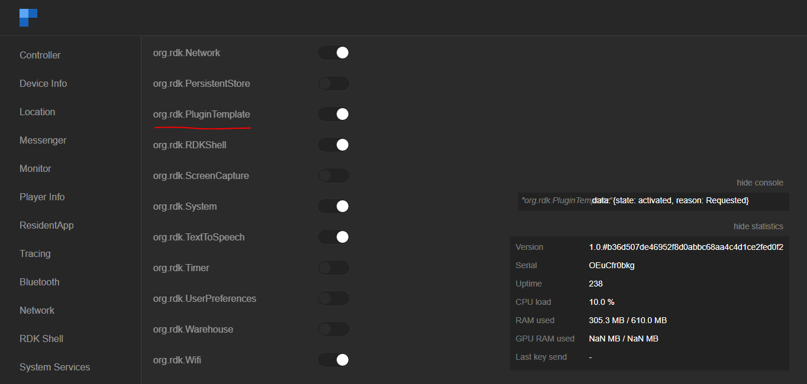

# 9. Controller UI:

Controller UI is a web UI that can be launched from a host machine's (machine under the same network where RDK Set top box resides) browser. This UI can be loaded with the RDK Set top box's IP address with Thunder's port number configured (here). RDKServices uses `9998` as port.

    URL: http://<RDK Set top box's IP address>:9998

