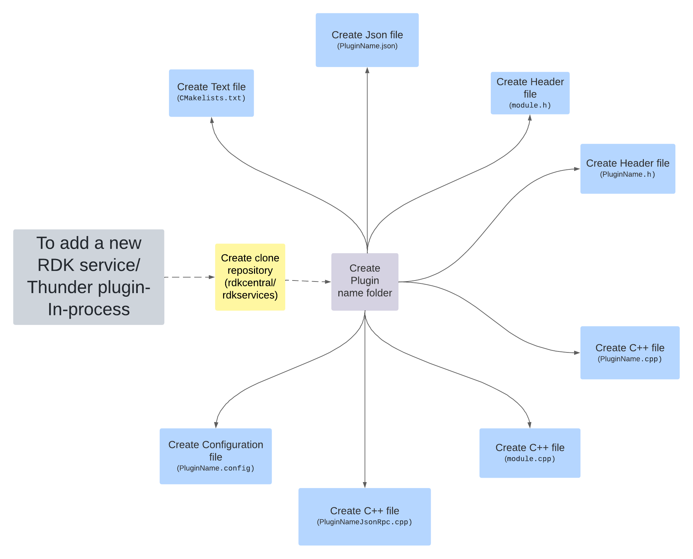

# **Follow the below steps to create a new RDK service/ Thunder plugin - In-process plugin.**

1.  [**Create Project Folder**](createfolder.md)
2.  [**Plugin Json API Spec**](PluginJSONfile.md)
3.  [**Headers Files**](headerfiles.md)
4.  [**Source Files**](Sourcefiles.md)
5.  [**Plugin Config File**](Pluginconfigfiles.md)
6.  [**Plugin metadata JSON file**](PluginmetadataJSONfile.md)
7.  [**Create CHANGELOG file**](CHANGELOGfile.md)
8.  [**Compilation & Install**](Comp%26Installfile.md)
9.  [**Controller UI**](ControllerUI.md)
10. [**New Plugin test and validation**](Test%26Validation.md)

For example, Please follow the steps involved in creation of **FooPlugin** that implements an API setValue to set a key/value and an event onValueChanged that is triggered whenever setValue is called.