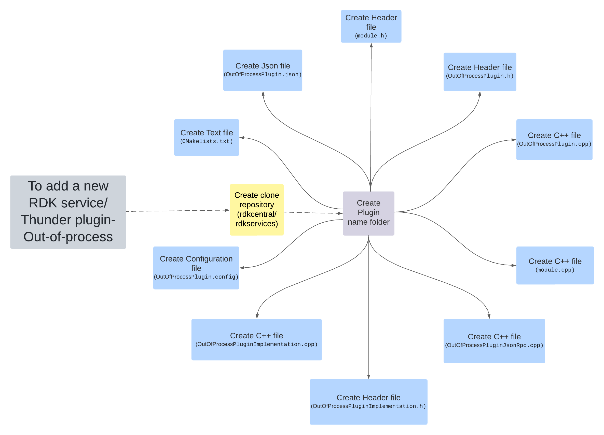
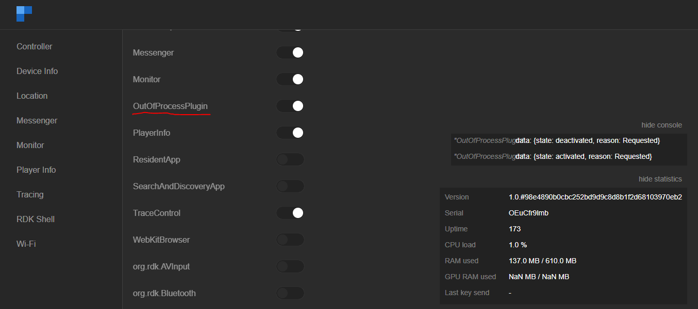
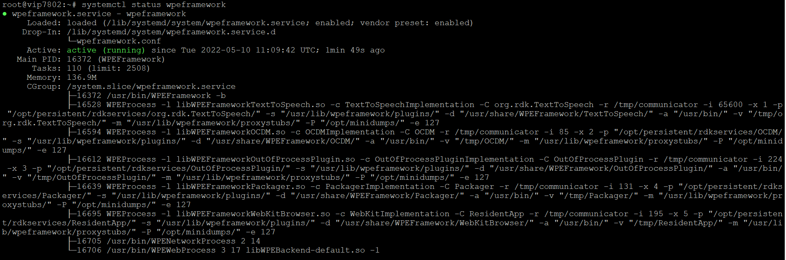

# **How to add a new RDK service/Thunder plugin**
- Here the plugin is developed as an out-of-process that runs as a separate thread from WPEFrameworkServices. The particular service can communicate with the WPEFramework using COMRPC. It has a web-based controller UI.

For example BrowserPlugin (cobalt, webkit, spark, Netflix). 

## **Please follow the below steps to create a new RDK service/ Thunder plugin - Out-of-process plugin.**



1. Create a clone repository of [rdkcentral/ rdkservices](https://github.com/rdkcentral/rdkservices).

2. Navigate to the cloned repository.

3. Create a new folder with a unique name for the plugin.

4. Inside the plugin directory, create a new `CMakeLists.txt` file.
-	This file contains a set of directives and instructions describing the project's source files and targets. This is used to compile the Plugin code to generate the plugin library (Shared library by default; `“.so”`). External dependencies can be included/linked to the target with the help of `CMakeLists.txt` configurations.

For example, Please refer `CMakelist` of `OutOfProcessPlugin`

```C++
set(PLUGIN_NAME OutOfProcessPlugin)                          # to set a environment variable set(<variable> <value>)

set(MODULE_NAME ${NAMESPACE}${PLUGIN_NAME})

find_package(${NAMESPACE}Plugins REQUIRED)               # to Finds and loads settings from an external project.
```

5. Create a new JSON file with a unique name `PluginName.json`.
-	This file contains the plugin's information like schema, information and interface json file.
    - **Schema**: A schema defines the structure of a JSON document, including the type of data that can be stored in it, the names of fields and their types, and constraints on the values that can be stored in those fields. The purpose of a schema is to provide a blueprint for how the data in a JSON document should be organized, so that applications can validate the data before processing it.

    - **Information**: Information refers to the actual data stored in a JSON document. This data can be in the form of key-value pairs, arrays, or nested structures. The information stored in a JSON document can be used to represent a wide range of data, including configuration settings, metadata, and other types of structured data.

    - **Interface**: An interface defines the way in which a JSON document can be accessed and processed by an application. It specifies the methods and properties that are available for accessing and manipulating the data stored in the document, as well as any constraints or requirements for using those methods and properties. Interfaces are often used to define the API (Application Programming Interface) for a JSON document, making it easier for developers to interact with the data stored in the document.

- Here the `"outofprocess"` should be `true` or the `mode` should be `Local`, which indicates that the plugin runs as a separate process.

    For example, `OutOfProcessPlugin.json`
```Javascript
{

 "locator":"libWPEFrameworkOutOfProcessPlugin.so",

 "classname":"OutOfProcessPlugin",

 "precondition":[

  "Platform"

 ],

 "autostart":true,

 "configuration":{

  "root":{

   "outofprocess":true or "mode" : "Local"

  }

 }

}
```
**Thunder interfaces** - Every Out-Of-Process Thunder Plugin will be having their own thunder interface which will be saved and maintained in a separate repo [Thunder interfaces](https://github.com/rdkcentral/ThunderInterfaces).

6. Create a `module.h` header file as metioned below with the required PluginName. 
 ```C++
#pragma once
#ifndef MODULE_NAME
#define MODULE_NAME Plugin_PLuginName
#endif

#include <plugins/plugins.h>
#include <tracing/tracing.h>

#undef EXTERNAL
#define EXTERNAL

```

7. Create a header file with name `pluginName.h`.
- This header file includes the support for JSON request, response, logging etc.

- Declare the plugin class in this which should contain all the structures, variables, and methods which are needed for plugin implementation.

- A plugin should derive from the `PluginHost::JSONRPC` public class if it intends to use the JSON-RPC protocol. By doing this, the plugin can use the base class to access the JSON-RPC protocol's capabilities and functionalities. This enables the plugin to interact via the JSON-RPC interface with other programmes or systems. Thunder Plugin must adhere to the `PluginHost::IPlugin` interface.

For example, `OutOfProcessPlugin.h`
```C++
namespace WPEFramework {

  namespace Plugin {

   class PluginName : public PluginHost::IPlugin, public PluginHost::IWeb, public PluginHost::JSONRPC {

   public:

     PluginName()

      : _skipURL(0)

      , _service(nullptr)

      , _subSystem(nullptr)

     {

      RegisterAll();

     }

     virtual ~PluginName()

     {

      UnregisterAll();

     }

   }

  public:
    BEGIN_INTERFACE_MAP (OutOfProcessPlugin)
    INTERFACE_ENTRY (PluginHost::IPlugin)
    INTERFACE_ENTRY (PluginHost::IWeb)
    INTERFACE_ENTRY (PluginHost::IDispatcher)
    INTERFACE_AGGREGATE(Exchange::IOutOfProcessPlugin, _implementation)
    END_INTERFACE_MAP

   ---------------------------------------

   ---------------------------------------

  }

}
```

8. Create a new C++ file with `PluginName.cpp` name which is used to declare the module name for the Plugin.
For example, `OutOfProcessPlugin.cpp` 

- The plugin should register using service registration MACRO as declared below :
```C++
 namespace WPEFramework {
   namespace Plugin { 
    SERVICE_REGISTRATION(Plugin, 1, 0);
    ---------------------------------------
    ---------------------------------------
    ---------------------------------------
   }
  }
  ```

- Create the required objects of its plugin class type using `constructor` and start `initialization` for the created objects of its Plugin class type within `IPlugin Initialize()`.

- Return a non-empty string containing helpful error information if there was any `initialization error`. The plugin won't activate as a result of this, and the developer or caller will also receive this error information.

- Make sure that `IPlugin Deinitialize()`, which is called when the plugin is deactivated, cleans up the initialization carried out with `IPlugin Initialize()` using `deconstructor`.

Example:
```C++
Const string OutOfProcessPlugin::Initialize(PluginHost::IShell* /* service */)

    {

    //shared pointer initialized

    //initialize external library

     // Access the plugin interface properties and methods

       _implementation = service->Root<Exchange::IOutOfProcessPlugin>(_connectionId, 2000, _T("OutOfProcessPluginImplementation"));

        LOGINFO();

        return (string());

        }

void OutOfProcessPlugin::Deinitialize(PluginHost::IShell* /* service */)

        {

    //shared pointer deinitialized

    //deinitialize external library

        LOGINFO();

        }
```
 **Proxy/Stub generator:**
  - **Proxy** - object in one process space representing the ’real’ object in another process space; proxy takes care of marshalling the parameters.
  - **Marshalling** - process of transforming the memory representation of an object into a data format suitable for storage or transmission. It is typically used when data must be moved between different parts of a computer program or from one program to another. 
  - **Stub** - object in the process space that contains the actual object; takes care of unmarshalling the request from Proxy and on behave of the Proxy object executes the call on the real object.

    Create JSON header and C++ file using the [proxy/stub generator](https://github.com/rdkcentral/Thunder/tree/master/Tools/ProxyStubGenerator).

- Process handler plugin services to receive request and sent responses based on the services :
```C++
Core::ProxyType<Web::Response> OutOfProcessPlugin::Process(const Web::Request &request)

{

  Core::ProxyType<Web::Response> result(PluginHost::IFactories::Instance().Response());


  //Handle the service request and send the responses

  -----------------

  -----------------

  return result;

}
```
9. Create a `module.cpp` C++ file as mentioned below.
```C++
#include "Module.h"

MODULE_NAME_DECLARATION(BUILD_REFERENCE)
```

10. Create a C++ file with name `PluginNameJsonRpc.cpp` which contains the registration for methods and properties which are declared in `PluginName.h`.

- Complete `RegisterAll()` and `UnregisterAll()` for the all the required classes, objects, or Variables.

For eaxmple, `OutOfProcessPluginJsonRpc.cpp`
```C++
namespace WPEFramework {

    namespace Plugin {  

          //registration

         void OutOfProcessPlugin::RegisterAll()

          {

               // methods and properties declared in Plugin.h are registered here

                  -------------------

                  ------------------- 

          }

         void OutOfProcessPlugin::UnregisterAll()

         {

         }                        

    }

} 
```

11. Create a header file with name `"PluginName"Implementation.h`.

- Declare the plugin class in this which should contain all the structures, variables, and methods which are needed for plugin implementation.

For example, `OutOfProcessPluginImplementation.h`
```C++
#include "Module.h"
#include <interfaces/IOutOfProcessPlugin.h>

namespace WPEFramework {
namespace Plugin {

    class OutOfProcessPluginImplementation : public Exchange::IOutOfProcessPlugin {
    public:
        OutOfProcessPluginImplementation(const OutOfProcessPluginImplementation&) = delete;
        OutOfProcessPluginImplementation& operator=(const OutOfProcessPluginImplementation&) = delete;

        OutOfProcessPluginImplementation();
        ~OutOfProcessPluginImplementation() override;

        BEGIN_INTERFACE_MAP(OutOfProcessPluginImplementation)
        INTERFACE_ENTRY(Exchange::IOutOfProcessPlugin)
        END_INTERFACE_MAP

    };

}  // namespace Plugin
}  // namespace WPEFramework
```
12. Create a C++ file with name `"PluginName"Implementation.cpp` which contain all the definitions for the methods declared in the <PluginName>Implementation.h and those definitions should be defined inside the below namespace.

For example, `OutOfProcessPluginImplementation.cpp`

- The plugin should register using service registration MACRO as declared below:
```C++
#include "OutOfProcessPluginImplementation.h"

namespace WPEFramework {
namespace Plugin {

   SERVICE_REGISTRATION(OutOfProcessPluginImplementation, 1, 0);
   -------------------------------------------------

   -------------------------------------------------  

}  // namespace Plugin
}  // namespace WPEFramework
```

13. Create a configuration file `PluginName.config` which is used to set configurations of the Plugin.

- Here `outofprocess` is set to `true` or `mode` is set to `Local`, to make plugin as out of process plugin.

For example, `OutOfProcessPlugin.config`

```C++
set (autostart true)

set (preconditions Platform)

map()

    kv(outofprocess true) or kv(mode "Local")

end()

ans(rootobject)
```

14. Create a `CHANGELOG.md` file where you can list all of the modifications you have made to the plugin over time with version updates.
- VERSION_NUMBER_MAJOR
- VERSION_NUMBER_MINOR
- VERSION_NUMBER_PATCH

15. To add new Out-Of-Process plugin in rdkservices, Compile and execute the `CMakeLists.txt` which contains a set of directives and instructions describing the project's source files and targets (executable, library, or both).
- Using the `CMake` utility, this file contains the tasks needed to be done to make a plugin. Additionally, it contains packages, libraries needed to compile, as well as other plugin configuration options.

- Adds a library target called `name` to be built from the source files listed in the command invocation. The `name` corresponds to the logical target name and must be globally unique within a project.
```C++
add_library(${MODULE_NAME} SHARED

    OutOfProcessPlugin.cpp

    OutOfProcessPluginJsonRpc.cpp

    OutOfProcessPluginImplementation.cpp

    Module.cpp)
```

- This file is compiled and generate `.so` file.
- Enable or disable the plugin flag in the recipe file.
- Add this flag into the main CMakeLists.txt file present in the rdkservice.
- Add these lines ( by default its disabled ) :
For example,
```python
    if(PLUGIN_OUTOFPROCESSPLUGIN)
        add_subdirectory(OutOfProcessPlugin)
    endif()
```
- It will invoke CMakeLists file present in the `pluginName.json [OutOfProcessPlugin.json]`.

## Compilation and Install:
- To include `PluginName [OutOfProcessPlugin]` plugin in build sequence, Open rdkservices recipe file and add below line. By default; its configured to be disabled while building rdkservices.

```git command
$ vi meta-rdk-video/recipes-extended/rdkservices/rdkservices_git.bb
```
    PACKAGECONFIG[OutOfProcessPlugin]  = " -DPLUGIN_OutOfProcessPlugin=OFF,-DPLUGIN_OutOfProcessPlugin=ON, "
- To include the plugin in rdkservises build; add the same in packageconfig in rdkservices recipe:
    PACKAGECONFIG += " OutOfProcessPlugin"

- To compile and install in build directory :
    $ bitbake -c compile -f rdkservices

- Once build complete copy `.json`, `.so` files into `raspberrypi`.

    - Copy the PluginName.json (Ex: OutOfProcessPlugin.json) file to `/etc/WPEFramework/plugins` in `raspberrypi`

    - Copy the plugin library `libWPEFrameworkOutOfProcessPlugin.so` to `/usr/lib/wpeframework/plugins`

- So that the controller plugin identify it and list it in the `WebUI (controller UI)`.

## Controller UI:
- Controller UI is a web UI that can be launched from a host machine's (machine under the same network where RPi resides) browser. This UI can be loaded with the RPi box's IP address with Thunder's port number configured (here). RDKServices uses **9998** as port.

    URL: http://<Rpi's IP address>:9998




## New Plugin test and validation for Out-Of-Process Plugin:
- Each RDK Service can be validated through JSON RPC Commands through HTTP. It has a request and response in JSON format.
Note: the argument is case sensitive.

"callsign":"OutOfProcessPlugin"

| Function | Request | Response |
| :-------- | :-------- | :-------- |
| Activate controller |curl http://127.0.0.1:9998/jsonrpc --header "Content-Type: application/json" --request POST --data '{ "jsonrpc":"2.0", "id":3, "method":"Controller.1.activate", "params":{"callsign":"OutOfProcessPlugin"} }' |{"jsonrpc":"2.0","id":3,"result":{"success":true}}|
|Deactivate controller|curl http://127.0.0.1:9998/jsonrpc --header "Content-Type: application/json" --request POST --data '{ "jsonrpc":"2.0", "id":3, "method":"Controller.1.deactivate", "params":{"callsign":"OutOfProcessPlugin"} }'|{"jsonrpc":"2.0","id":3,"result":{"success":true}}|
|Get fps|curl http://127.0.0.1:9998/jsonrpc --header "Content-Type: application/json" --request POST --data '{"jsonrpc":"2.0", "id":3, "method":"OutOfProcessPlugin.1.fps"}'|{"jsonrpc":"2.0","id":3,"result":32}|
|Get plugin id|curl http://127.0.0.1:9998/jsonrpc --header "Content-Type: application/json" --request POST --data '{"jsonrpc":"2.0", "id":3, "method":"OutOfProcessPlugin.1.getpluginid"}'|{"jsonrpc":"2.0","id":3,"result":6501}|
|Get Plugin Status |curl -d '{"jsonrpc":"2.0","id":"3","method": "Controller.1.status@OutOfProcessPlugin"}' http://127.0.0.1:9998/jsonrpc | {"jsonrpc":"2.0","id":3,"result":[{"callsign":"OutOfProcessPlugin","locator":"libWPEFrameworkOutOfProcessPlugin.so","classname":"OutOfProcessPlugin","autostart":true,"precondition":["Platform"],"configuration":{"root":{ "outofprocess":true } } ,"state":"activated","observers":0 "module":"Plugin_OutOfProcessPlugin","hash":"engineering_build_for_debug_purpose_only"}]}|

**Confirm OutOfProcessPlugin running as separate process.**

#systemctl staus wpeframework or ps -aux




