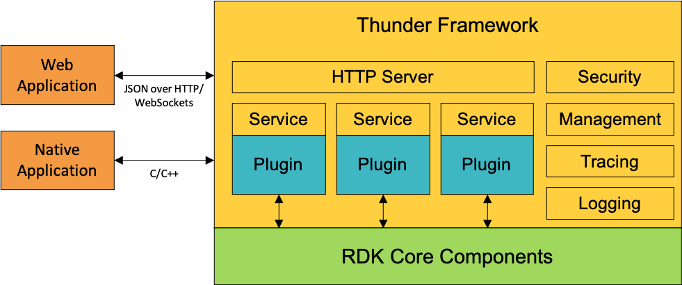

# RDK Services Overview

RDK services are a set of JSON-RPC services for accessing component functionality that is available on set-top devices. The services are implemented as plugins for the Thunder framework. The Thunder framework is responsible for, among other things, managing plugins and handling client requests.

Many of the traditional services available on an RDK set-top device are implemented as Thunder plugins. These plugins are commonly referred to as *RDK services* because of their JSON-RPC services-based interface. The terms RDK services and Thunder plugins are synonymous.

RDK services are invoked using their JSON-RPC service interface over HTTP or Web Sockets. This makes RDK services services easily accessible to Lightning applications or any web client (standalone or browser-based) that can process JSON. For native applications, you can also invoke RDK services directly using C/C++ native code.

